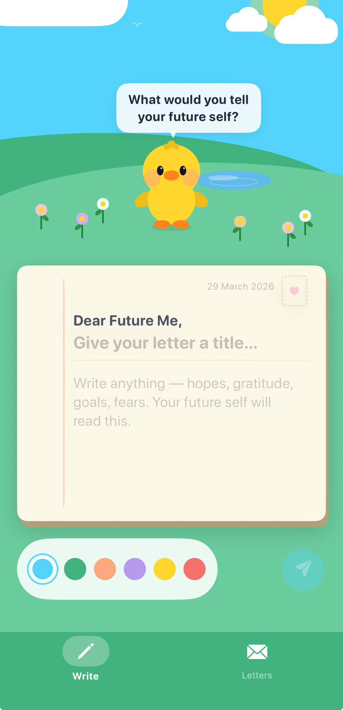
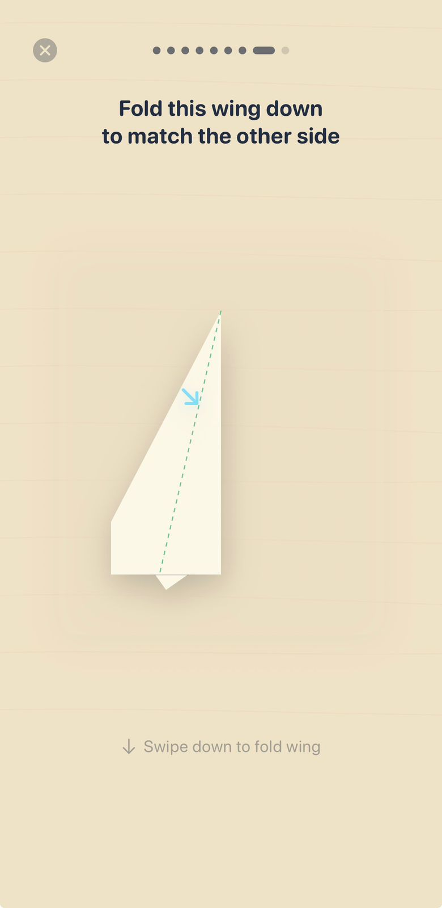
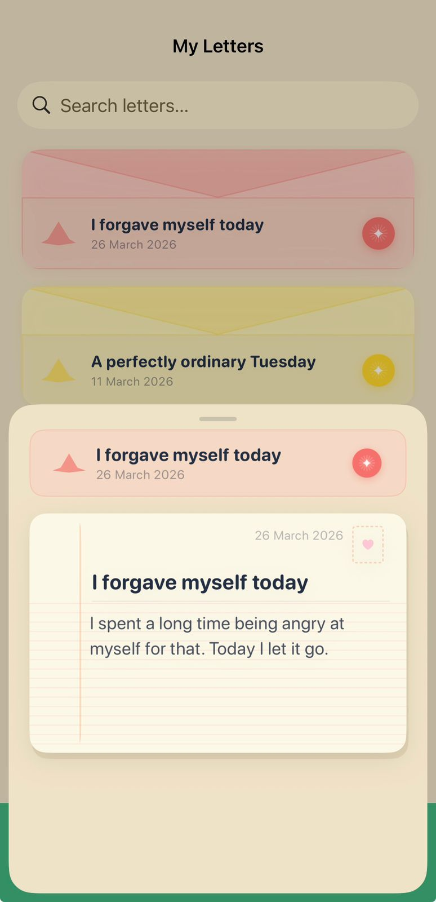

# Dear Ducky

**Write a letter to your future self, fold it into a paper plane with your fingers, then throw your phone to send it.**

An offline iOS app built solo in SwiftUI for my first Apple Developer Academy challenge (March 2026). It was also my first Swift project.

<!-- TODO: demo GIF of the fold + throw goes here: docs/demo.gif -->

<p align="center">
  
  &nbsp;
  
  &nbsp;
  
</p>

## Why it exists

People lose their sense of growth because the details of past struggles and small wins blur together. Research on **self-distancing** shows that reflecting on yourself from an outside view, for example writing to a future self, helps people process hard experiences more calmly. People only write honestly when the space feels private, so the app has no network, no account and no sharing. The fold and throw turn a short note into a small ritual instead of another text field.

## Highlights

- **An eight-fold paper plane, drawn entirely in code.** One custom SwiftUI `Shape` returns a different `Path` for each step of a real paper-plane fold, computed from the view's frame. Dashed crease guides, completed crease lines and direction arrows are separate shapes layered on top. There are no image assets. See [`FoldingPaper.swift`](DearDucky/Views/Ritual/Components/FoldingPaper.swift).
- **Direction-aware fold gestures.** Each fold has its own axis (right, down or inward). The `DragGesture` reads only that axis, commits the fold past 75% of the drag and springs back otherwise. A tap also advances, as a fallback. See [`RitualView.swift`](DearDucky/Views/Ritual/RitualView.swift).
- **Custom Core Haptics patterns.** A `CHHapticEngine` plays hand-tuned patterns: a soft rustle when your finger touches the paper, detent ticks at 50% and 85% of the drag, a crease snap that gets stronger and sharper with every fold, and three rising pulses on the last fold. The engine restarts itself after a reset and falls back to `UIImpactFeedbackGenerator` on devices without haptics. See [`PaperFoldHaptics.swift`](DearDucky/Resources/PaperFoldHaptics.swift).
- **Throw to send, with Core Motion.** After the last fold the accelerometer is sampled at about 60 Hz. A spike above 1.8 g launches the plane into an animated sky. A Skip button covers the simulator and people who cannot make the motion.
- **Private, on-device storage with SwiftData.** A single `@Model`, a `@Query` sorted newest first, and a searchable gallery where each letter appears as an envelope in the color you picked.
- **Illustrated in SwiftUI.** The duck mascot, based on my own plushie, is built from SwiftUI shapes, and colors and backgrounds live in one design-system file.

## How it works

```
Write a letter  ->  pick an envelope color  ->  fold it (8 steps)  ->  throw your phone  ->  saved to Letters
```

## Project structure

```
DearDucky/
├── DearDuckyApp.swift          App entry, SwiftData container
├── Models/
│   └── Letter.swift            @Model: title, content, date, envelope color
├── Resources/
│   ├── DesignSystem.swift      Colors, envelope palette, sky and table backgrounds
│   └── PaperFoldHaptics.swift  Core Haptics patterns
└── Views/
    ├── Main/                   Root view and custom tab bar
    ├── Write/                  Letter card, color picker, send button, duck mascot
    ├── Ritual/                 Fold sequence, launch, motion detection
    │   └── Components/         Paper shape, crease lines, arrows, step dots
    ├── Gallery/                Searchable letter list and letter sheet
    └── Shared/
```

## Tech

SwiftUI · SwiftData · Core Haptics · Core Motion · iOS 26 · Xcode 26 · no third-party dependencies

## Run it

1. Clone the repo and open `DearDucky.xcodeproj` in Xcode 26 or later.
2. Select your team under **Signing & Capabilities**.
3. Run on an iPhone. Haptics and the throw gesture need a real device. In the simulator, use **Skip** on the fold screen.

## My role

Solo design and iOS development: concept, interaction design, illustration and all the code. The early research and challenge framing were done with my Academy team, where I was Product Owner.

## What I'd improve next

- **Make the paper follow your finger.** Right now each fold snaps to the next shape when the gesture commits. Giving the shape `animatableData` and interpolating between paths would let the paper bend in real time during the drag.
- **Move the ritual logic out of the view.** A small view model for fold state and launch would replace the `DispatchQueue` timing chain and make the sequence unit-testable.
- **Accessibility polish.** VoiceOver labels for the fold steps, Reduce Motion support for the launch, and removing debug logging.

## References

- Kross, E., & Ayduk, O. (2017). Self-distancing: Theory, research, and current directions. *Advances in Experimental Social Psychology, 55*, 81–136. https://doi.org/10.1016/bs.aesp.2016.10.002

---

